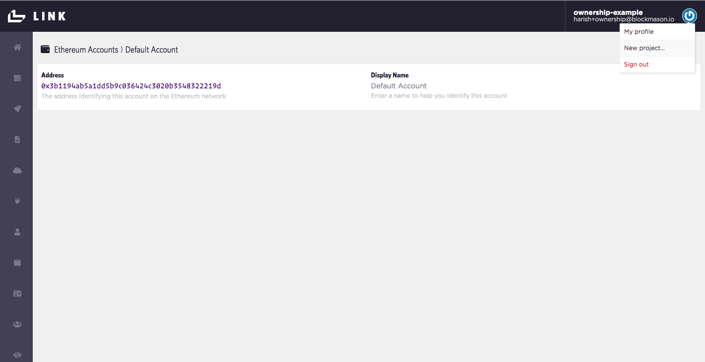
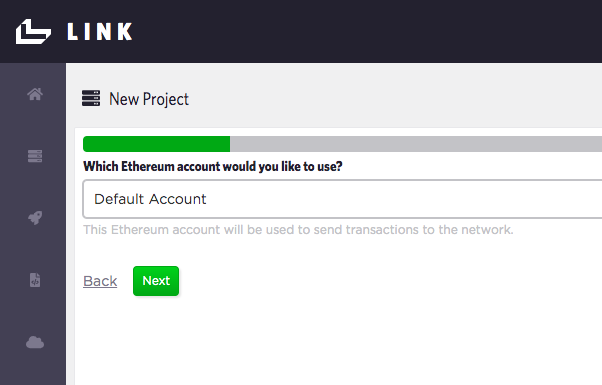
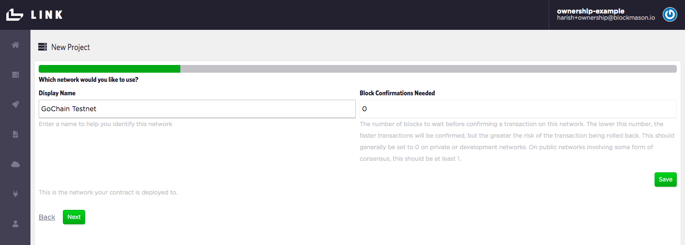
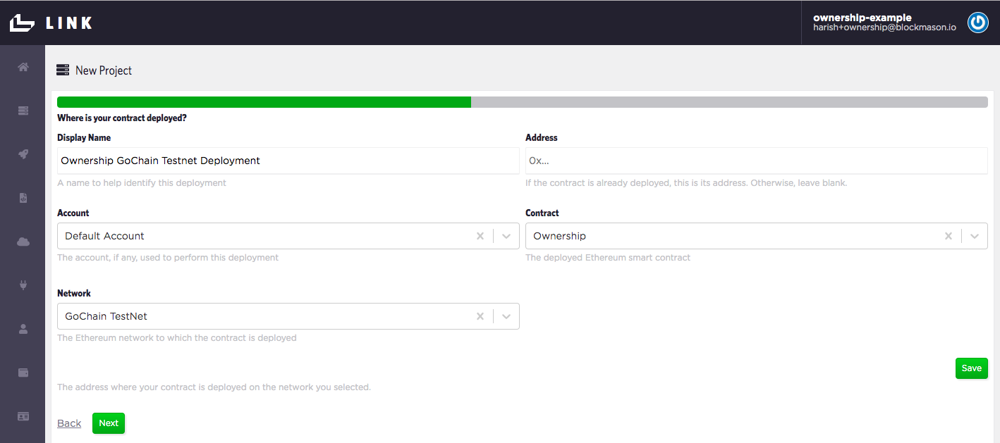
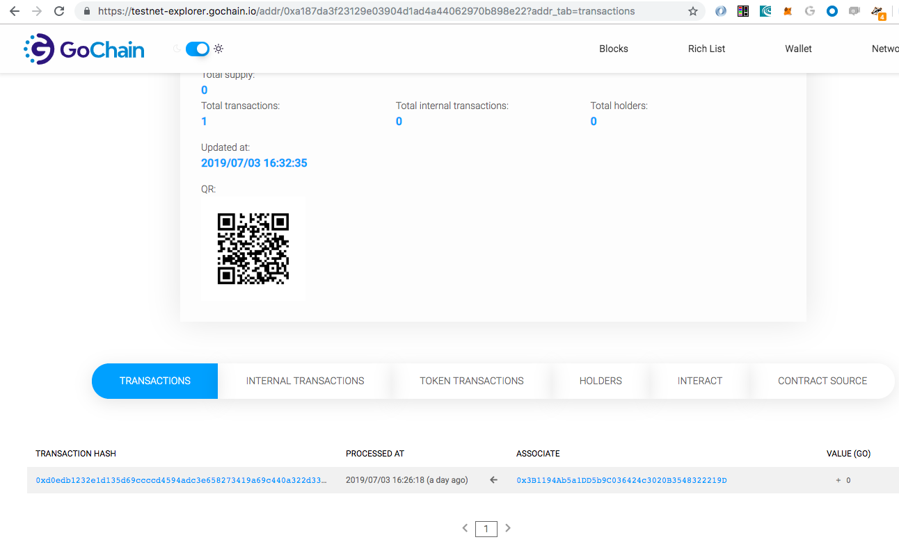

# Using GoChain with Blockmason Link

Blockmason is excited to announce the integration of GoChain into its functions-as-a-service (FaaS) product [Link](https://mason.link). Link allows developers to use smart contracts and the power of blockchain in their web or mobile applications with *very little to no prior blockchain experience.* Link creates classic, conventional, web-based APIs for any smart contract written on a programmable blockchain such as GoChain.

[GoChain](https://gochain.io) is a scalable, high performance and low-cost blockchain that supports smart contracts and distributed applications. GoChain is fully compatible with existing Ethereum wallets, smart contracts, and tools and boasts significantly faster transactions (1300 tps) and lower fees (7500x cheaper) than Ethereum. 

In this activity, we will use Link to record ownership of assets (in this example, collectible digital stamps) on the GoChain Testnet. 

**Note:** This example builds on an earlier activity posted here: https://blockmason.link/create-a-decentralized-ownership-app-using-blockmason-link

**It is recommended that you go through it first before proceeding here.** 

A simple front-end template is provided and [Parcel](https://parceljs.org/) will be used as the web application bundler and server.

The key steps of this activity are:
1. Setup project and install dependencies
2. Fund your Link account with test GO tokens
3. Create a basic Ownership smart contract
4. Deploy the smart contract to the GoChain Testnet blockchains using Link
5. Configure a front-end JavaScript file
6. Run your decentralized application (DApp) on GoChain Testnet

### Setup

You will need to set up the following for this activity:

> Install `Node` and `npm`: https://nodejs.org/en/download/ (note - you can also use `yarn`)

> Clone the Github repo: https://github.com/blockmason/simple-ownership-contract-demo into a new folder.

>  In the new folder, run `npm install` which will install the following key dependencies:

* `@blockmason/link-sdk` - https://www.npmjs.com/package/@blockmason/link-sdk - a simple SDK for interacting with the Link project.

* `parcel-bundler` - https://parceljs.org/getting_started.html - for bundling and running the web application

> Create a Blockmason Link account if you haven't done so already - register at https://mason.link/sign-up and then set up your demo organization.

### Fund your Link account with test GO

In the previous activity, we simply copied and pasted the Ownership smart contract code into the Link IDE and the contract was automatically deployed to the Link private blockchain without the need for acquiring any tokens to pay for gas or transaction costs. However, to deploy on the GoChain Testnet, as we will do in this activity, we need to fund our Link account with test GO.

> Log into Link and copy your default Ethereum account as shown:


> Ask for some free testnet GO in their [Testnet Telegram](https://t.me/gochain_testnet) to be sent to your Link account (e.g. `0x3b1194ab5a1dd5b9c036424c3020b3548322219d`).

You can confirm receipt of your testnet GO by searching your Link account address in the GoChain Testnet explorer https://testnet-explorer.gochain.io/home : 


### Deploy the Ownership Smart Contract
The `Ownership.sol` file in the `simple-ownership-contract-demo` repo contains a very simple Ownership Smart Contract programmed using Solidity (supported by both GoChain and Ethereum):
```
pragma solidity ^0.5.8;

contract Ownership {
    mapping(string => address) public ownerOf;
    address public authority;
    
    constructor() public {
        authority = msg.sender;
    }
    
    function setOwner(string memory asset, address owner) public {
        ownerOf[asset] = owner;
    }
}
```
* Ownership is recorded in a mapping called `ownerOf` between an asset name (some string) and an Ethereum wallet address.
  
* Using the keyword `public` for the `ownerOf` mapping object automatically provides us with a getter for that object.

* The `authority`, in this case, will be a Link managed Ethereum address.

As mentioned, in the previous activity, we simply copied and pasted the `Ownership.sol` contract code into the Link IDE and the contract was automatically deployed to the Link private blockchain. However, deploying to public blockchains such as GoChain and Ethereum require a few more steps.

> 1. In Link, open up the setting dropdown menu and select *`New Project`* which starts the new project wizard.



> 2. Under *Which contract would you like to use?*, select *`Create new`* and then copy and paste the `Ownership.sol` code into the *Source Code* field. We'll set the *Display Name* as `Ownership`. Press *`Save`* and *`Next`*.

.

> 3. Under *Which Ethereum account would you like to use?*, use the *`Default Account`*. This is the account we seeded earlier with test GO. 



> 4. Under *Which network would you like to use?*, select *`Create new`* and call it `GoChain Testnet`. Keep the *Block Confirmations Needed* at 0. Press *`Save`* and *`Next`*.



> 5. Under *Which connector would you like to use?*, select *`Create new`*. Call this connector `GoChain Testnet Connector` and use the URL `https://testnet-rpc.gochain.io` (see https://github.com/gochain-io/docs#network-rpc-urls for more details). Ensure the *Network* selected is *`GoChain Testnet`*. Press *`Save`* and *`Next`*.


> 6. Now we just need to label our Deployment. Under *Where is your contract deployed?*, select *`Create new`*. Call this deployment `Ownership GoChain Testnet Deployment`. Since we do not have **an existing contract deployment**, leave the *Address* field blank. Ensure the *Account* is the `Default Account`, the *Contract* is the `Ownership` contract and the *Network* `GoChain Testnet`. Press *`Save`* and *`Next`*.



> 7. Now we're ready to deploy our contract to the GoChain Testnet. Press `Deploy` and you should get a deployment in progress indicator icon. This might take a few seconds to complete. If deployed correctly, you'll proceed to the next step to set up your API.


> 8. Now we label our Ownership contract API. Under *Name*, call it *`ownership-gochain-testnet`* Also add in a human-readable display name. Ensure you are using the correct *Contract Deployment*. Press *`Save`* and *`Next`*.


> 9. Now we label our Ownership API **Consumer**. This would normally be the name of the app or service calling the API. For this activity, the consumer is a `Collectible Stamps App`. Ensure you are using the correct *API* and *Account*. Press *`Save`* and *`Next`*.


> 10. Lastly, your consumer needs to authenticate with the Ownership API. An OAuth2.0 Client Secret is automatically generated. Ensure you are using the correct Principal/Consumer. Press *`Save`*, *`Next`* and then *`Finish`*.


Once you hit *`Finish`*, you should see your Ownership API documentation. Note the `client_id` and `client_secret` under *Authentication* which we will be using in our front-end app. 


Let's also check that our Ownership contract deployed correctly on the GoChain Testnet. Click on the `Ethereum Contract Deployments` menu item to see a list of contract deployments and their addresses. Copy and paste the address of the `Ownership GoChain Testnet Deployment` into the GoChain Testnet explorer https://testnet-explorer.gochain.io to see the details of your contract deployment.


In the above example, the contract address on GoChain is `0xa187da3f23129e03904d1ad4a44062970b898e22`.



And we see our contract deployed on GoChain!
